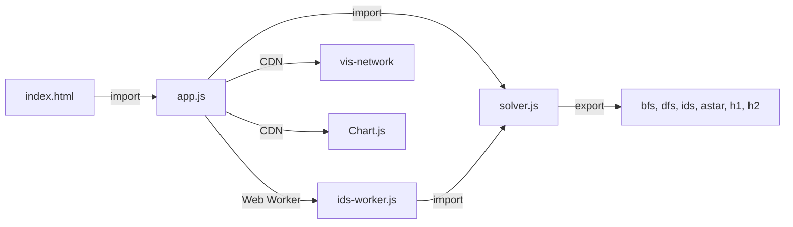

# Báo cáo chi tiết — Bài toán Vacuum World

> **Đồ án môn Nền tảng Trí tuệ Nhân tạo**
> Phân tích không gian trạng thái & so sánh giải thuật tìm kiếm mù vs có thông tin

---

## 1. Giới thiệu bài toán

**Vacuum World** là bài toán kinh điển trong AI (xuất phát từ sách *Artificial Intelligence: A Modern Approach* — Russell & Norvig). Một robot hút bụi hoạt động trên lưới 2D, mục tiêu là **hút sạch tất cả các ô bẩn** với chi phí ít bước nhất.

### Tại sao chọn bài toán này?

- Cấu trúc rõ ràng: trạng thái, hành động, mục tiêu đều phát biểu hình thức được.
- Không gian trạng thái đủ lớn để **bộc lộ sự khác biệt** giữa các giải thuật tìm kiếm (mù vs có thông tin).
- Dễ trực quan hoá: robot di chuyển trên lưới, hút bụi từng ô.

---

## 2. Phát biểu bài toán dưới dạng bài toán tìm kiếm

Bài toán được mô hình hoá theo **5 thành phần** của bài toán tìm kiếm (theo AIMA):

| Thành phần | Mô tả |
|---|---|
| **Trạng thái (State)** | Bộ `(vị_trí_robot, tập_ô_còn_bẩn)` |
| **Trạng thái khởi đầu (Initial State)** | Robot ở ô 0 (góc trên-trái), 4 ô bẩn cho trước |
| **Hành động (Actions)** | `{Up, Down, Left, Right, Suck}` — 5 hành động |
| **Hàm chuyển trạng thái (Transition)** | Di chuyển → đổi vị trí robot; Suck ở ô bẩn → xoá ô đó khỏi tập bẩn |
| **Kiểm tra mục tiêu (Goal Test)** | `tập_ô_bẩn = ∅` (sạch hết) |
| **Chi phí (Path Cost)** | Mỗi hành động cost = 1 (đồng nhất) |

### Các giả định
- **Quan sát đầy đủ (fully observable)**: robot biết toàn bộ trạng thái lưới.
- **Xác định (deterministic)**: hành động luôn cho kết quả dự đoán được.
- **Tĩnh (static)**: môi trường không thay đổi khi robot đang suy nghĩ.
- **Rời rạc (discrete)**: thời gian, không gian, hành động đều rời rạc.

---

## 3. Không gian trạng thái (State Space)

### 3.1. Biểu diễn trạng thái

Trạng thái được biểu diễn thông qua cấu trúc dữ liệu gồm 2 thành phần chính: vị trí robot và một mảng lưu vị trí các ô bẩn.

**Trong mã nguồn C (`c/vacuum.c`):**
```c
typedef struct { 
    int robot;         // Vị trí hiện tại của robot (từ 0 đến 11)
    int dirt[4];       // Mảng 4 phần tử lưu vị trí 4 ô bẩn ban đầu
} State;
```

**Trong mã nguồn JS (`web/solver.js`):**
```javascript
{ 
    robot: 0, 
    dirt: [3, 5, 8, 11] 
}
```

**Quy ước hoạt động:**
- `robot`: Lưu toạ độ 1D của robot trên lưới (tính bằng công thức `cell = row × W + col`).
- `dirt`: Lưu vị trí của các ô bẩn. 
  - Khi robot thực hiện hành động `Suck` (hút bụi) thành công tại một ô bẩn, giá trị tại vị trí đó trong mảng sẽ được gán bằng **`-1`** để đánh dấu là đã sạch.
  - Ví dụ: Robot hút ô số 3, mảng sẽ trở thành `[-1, 5, 8, 11]`.

> **Ví dụ (lưới 5×5):** Robot ở ô 0, các ô bẩn {4, 12, 20, 24}
> → `robot = 0`, `dirt = [4, 12, 20, 24]`. Sau khi hút xong ô 4:
> → `dirt = [3, -1, 8, 11]` (slot 1 chuyển thành `-1`, các slot khác giữ nguyên vị trí).

### 3.2. Kích thước không gian trạng thái

Công thức tổng quát:

$$|S| = n \times 2^k$$

Trong đó:
- `n` = số ô trên lưới (robot có thể ở bất kỳ ô nào)
- `k` = số ô bẩn ban đầu (mỗi ô bẩn có 2 trạng thái: bẩn hoặc sạch)

> [!IMPORTANT]
> Thực tế không phải mọi trạng thái trong `n × 2^k` đều **đạt tới được** (reachable) từ trạng thái khởi đầu.
> Công thức này cho **cận trên** — số trạng thái tối đa có thể tồn tại.

### 3.3. Cấu hình cụ thể của dự án

#### Lưới 5×5 (cấu hình web demo)

```
 R  .  .  .  *
 .  .  .  .  .
 .  .  *  .  .
 .  .  .  .  .
 *  .  .  .  *
```

| Thông số | Giá trị |
|---|---|
| Kích thước lưới | 5 cột × 5 hàng = **25 ô** |
| Số ô bẩn ban đầu | **4** ô: {4, 12, 20, 24} |
| KGTT đạt tới (cận trên) | 25 × 2⁴ = **400 trạng thái** |
| Robot khởi đầu | Ô 0 (góc trên-trái) |

#### Lưới 5×5 (cấu hình C gốc)

```
 R  .  .  .  *
 .  .  .  .  .
 .  .  *  .  .
 .  .  .  .  .
 *  .  .  .  *
```

| Thông số | Giá trị |
|---|---|
| Kích thước lưới | 5 × 5 = **25 ô** |
| Số ô bẩn ban đầu | **4** ô: {4, 12, 20, 24} |
| KGTT đạt tới (cận trên) | 25 × 2⁴ = **400 trạng thái** |

### 3.4. Branching Factor

**Branching factor tối đa = 5** (Up, Down, Left, Right, Suck).

Tuy nhiên **branching factor thực tế thấp hơn** vì:
- Ô ở góc: chỉ 2 hướng di chuyển + Suck = tối đa 3.
- Ô ở cạnh: chỉ 3 hướng di chuyển + Suck = tối đa 4.
- `Suck` ở ô sạch bị bỏ qua (trả `null`, không sinh node con).
- Di chuyển ra ngoài lưới bị bỏ qua.

→ **Effective branching factor** trung bình ≈ 3–4.

### 3.5. Đồ thị không gian trạng thái

Không gian trạng thái là **đồ thị có hướng có chu trình** (vì robot có thể đi qua lại giữa các ô). Do đó:
- **Graph-search** (đóng node đã thăm) là **bắt buộc** để tránh lặp vô hạn.
- Mọi giải thuật trong dự án đều dùng graph-search (closed set / path-check).

---

## 4. Hàm chuyển trạng thái (Transition Function)

### 4.1. Các hành động

| Hành động | Tiền điều kiện | Kết quả |
|---|---|---|
| **Up** | `row > 0` | `robot ← (row-1) × W + col` |
| **Down** | `row < H-1` | `robot ← (row+1) × W + col` |
| **Left** | `col > 0` | `robot ← row × W + (col-1)` |
| **Right** | `col < W-1` | `robot ← row × W + (col+1)` |
| **Suck** | Ô hiện tại bẩn (`dirt.includes(robot)`) | slot chứa `robot` trong `dirt` ← `-1` |

### 4.2. Xử lý hành động không hợp lệ

- Di chuyển ra ngoài lưới → **không sinh node con** (trả `null`).
- `Suck` ở ô sạch → **không sinh node con** (trả `null`).

> [!NOTE]
> Trong solver thực tế ([solver.js](file:///d:/Dev/Workspaces/Vacuum%20World/web/solver.js#L64-L75)), hàm `applyAction()` trả `null` cho hành động bất khả thi, nên cây duyệt **không chứa node bất khả thi** — chỉ chứa các node ứng với trạng thái hợp lệ.

---

## 5. Heuristic

Dự án sử dụng **2 heuristic** cho thuật toán A*, cả hai đều **admissible** (không đánh giá cao hơn chi phí thực) và **consistent** (thoả tam giác):

### h₁ — Số ô bẩn còn lại

```
h₁(s) = số phần tử của s.dirt khác -1
```

**Lý do admissible:** Mỗi ô bẩn cần **ít nhất 1 bước Suck** để hút. Robot không thể hút nhiều ô cùng lúc → chi phí thực ≥ số ô bẩn.

### h₂ — Số ô bẩn + Manhattan tới ô bẩn gần nhất

```
h₂(s) = h₁(s) + min_{i ∈ dirt, i ≠ -1} manhattan(robot, i)
```

**Lý do admissible:** Ngoài h₁, robot còn phải **di chuyển ít nhất** khoảng cách Manhattan tới ô bẩn gần nhất trước khi có thể bắt đầu hút. Hai thành phần cộng lại vẫn ≤ chi phí thực.

**So sánh:** `h₂ ≥ h₁` luôn đúng → h₂ **thông tin hơn** (more informed) → A*(h₂) mở rộng **ít node hơn** A*(h₁).

---

## 6. Các giải thuật tìm kiếm

### 6.1. Tìm kiếm mù (Uninformed Search)

#### BFS — Breadth-First Search

| Thuộc tính | Giá trị |
|---|---|
| Cấu trúc dữ liệu | Hàng đợi FIFO |
| Tìm kiếm đồ thị | ✅ (closed set) |
| Tối ưu | ✅ (khi cost đồng nhất = 1) |
| Độ phức tạp thời gian | O(b^d) |
| Độ phức tạp không gian | O(b^d) — lưu toàn bộ frontier |

**Ưu điểm:** Luôn tìm lời giải ngắn nhất (cost đều = 1 → BFS ≡ UCS).
**Nhược điểm:** Tốn bộ nhớ — phải lưu tất cả node ở mức d trước khi sang mức d+1.

#### DFS — Depth-First Search

| Thuộc tính | Giá trị |
|---|---|
| Cấu trúc dữ liệu | Stack LIFO |
| Tìm kiếm đồ thị | ✅ (closed set) |
| Tối ưu | ❌ |
| Độ phức tạp thời gian | O(b^m) |
| Độ phức tạp không gian | O(b × m) — chỉ lưu đường đi hiện tại |

**Ưu điểm:** Tiết kiệm bộ nhớ (PeakFrontier thấp).
**Nhược điểm:** Không tối ưu — lời giải tìm được có thể dài hơn lời giải ngắn nhất. Trong cấu hình 5x5: DFS ra **24 bước** trong khi tối ưu là **20 bước**.

#### IDS — Iterative Deepening Search

| Thuộc tính | Giá trị |
|---|---|
| Cấu trúc dữ liệu | DFS có giới hạn sâu, tăng dần limit 0, 1, 2, … |
| Tìm kiếm đồ thị | Path-check (cycle-check trên đường đi hiện tại) |
| Tối ưu | ✅ |
| Độ phức tạp thời gian | O(b^d) — nhưng hệ số nhân cao vì lặp lại |
| Độ phức tạp không gian | O(b × d) — rất ít bộ nhớ |

**Ưu điểm:**
- **Tối ưu** như BFS.
- **Tiết kiệm bộ nhớ** như DFS (PeakFrontier ≈ độ sâu lời giải).

**Nhược điểm:**
- Expanded **rất cao** vì mỗi vòng limit phải duyệt lại từ đầu. Trong cấu hình 5x5: Expanded = **4,508,128** (so với BFS chỉ 375).

> [!IMPORTANT]
> IDS dùng **cycle-check trên đường đi** (không phải closed set toàn cục) để giữ tính tối ưu. Nếu dùng closed set toàn cục, IDS sẽ bỏ lỡ đường tối ưu qua node đã thăm ở vòng limit trước.

### 6.2. Tìm kiếm có thông tin (Informed Search)

#### A* Search

| Thuộc tính | Giá trị |
|---|---|
| Cấu trúc dữ liệu | Min-heap theo `f = g + h` |
| Tìm kiếm đồ thị | ✅ (closed set + lazy deletion) |
| Tối ưu | ✅ (khi h admissible + consistent) |
| Độ phức tạp thời gian | Phụ thuộc chất lượng h |
| Độ phức tạp không gian | O(b^d) — lưu tất cả node đã sinh |

**Ưu điểm:**
- **Tối ưu** khi heuristic admissible.
- **Mở rộng ít node nhất** trong các giải thuật tối ưu (nhờ heuristic dẫn đường).
- h₂ thông tin hơn h₁ → A*(h₂) mở rộng ít hơn A*(h₁).

**Nhược điểm:**
- Cần thiết kế heuristic (domain knowledge).
- Bộ nhớ tương đương BFS.

**Chi tiết triển khai:**
- **Binary min-heap** tự viết (JS thuần không có built-in priority queue).
- **Lazy deletion**: khi pop node đã nằm trong closed → bỏ qua, không mở rộng.
- **Best-g tracking**: chỉ push node mới nếu `g` tốt hơn `g` đã biết cho cùng trạng thái.

---

## 7. Kết quả thực nghiệm

### 7.1. Cấu hình 5×5 (25 ô, 4 ô bẩn — web demo)

| Giải thuật | SolLen | Expanded | Generated | PeakFrontier | Tối ưu? |
|---|---|---|---|---|---|
| **BFS** | 20 | 375 | 1232 | 44 | ✅ |
| **DFS** | 24 | 24 | — | — | ❌ |
| **IDS** | 20 | 4,508,128 | — | — | ✅ |
| **A\*(h₁)** | 20 | 361 | — | — | ✅ |
| **A\*(h₂)** | 20 | 232 | — | — | ✅ |

### 7.2. Phân tích kết quả

#### Về độ dài lời giải (SolLen)
- BFS, IDS, A*(h₁), A*(h₂) đều ra **20 bước** → đều **tối ưu**.
- DFS ra **24 bước** → **không tối ưu** (dài hơn 4 bước).

#### Về số node mở rộng (Expanded)
```
A*(h₂) < A*(h₁) < BFS << IDS << DFS(không so sánh được vì khác mục tiêu)
  232     361      375   4,508,128
```

- **A\*(h₂) hiệu quả nhất**: chỉ 232 node, ít hơn BFS **38%** nhờ heuristic dẫn đường.
- **A\*(h₁) vs A\*(h₂)**: h₂ tiết kiệm **35%** so với h₁ — minh chứng heuristic thông tin hơn → ít duyệt hơn.
- **IDS tốn nhất**: 4,508,128 node — gấp **12,021 lần** BFS — vì phải lặp lại từ gốc mỗi vòng limit. Đây là cái giá của việc tiết kiệm bộ nhớ.

#### Về bộ nhớ đỉnh (PeakFrontier)
- **IDS thấp nhất** (≈ độ sâu lời giải = 20) — lợi thế lớn.
- **BFS cao nhất** (44 node trong frontier cùng lúc).
- IDS hy sinh thời gian (Expanded cao) để đổi lấy bộ nhớ thấp.

---

## 8. So sánh tổng hợp các giải thuật

| Tiêu chí | BFS | DFS | IDS | A*(h₁) | A*(h₂) |
|---|---|---|---|---|---|
| **Tối ưu** | ✅ | ❌ | ✅ | ✅ | ✅ |
| **Đầy đủ** | ✅ | ✅* | ✅ | ✅ | ✅ |
| **Hiệu quả tính toán** | Trung bình | Cao (nhưng lời giải kém) | Thấp | Cao | **Cao nhất** |
| **Hiệu quả bộ nhớ** | Thấp | Cao | **Cao nhất** | Thấp | Thấp |
| **Cần domain knowledge** | ❌ | ❌ | ❌ | ✅ | ✅ |

> \* DFS đầy đủ trong triển khai này nhờ dùng graph-search (closed set), tránh lặp vô hạn.

### Kết luận rút ra

1. **A\*(h₂) là giải thuật tốt nhất** nếu có heuristic: tối ưu, ít duyệt nhất.
2. **IDS là lựa chọn tốt nhất cho tìm kiếm mù** khi bộ nhớ hạn chế: tối ưu như BFS, bộ nhớ O(bd) như DFS.
3. **DFS chỉ nên dùng khi chỉ cần tìm _một_ lời giải bất kỳ** (không cần ngắn nhất) và ưu tiên tốc độ/bộ nhớ.
4. **Heuristic thông tin hơn = ít duyệt hơn**: h₂ > h₁ → A*(h₂) expanded 232 < A*(h₁) expanded 361.

---

## 9. Kiến trúc mã nguồn

### 9.1. Sơ đồ file

```
Vacuum World/
├── c/
│   ├── vacuum.c          ← bản gốc C (5×5), dùng làm tham chiếu
│   └── vacuum.exe
├── web/
│   ├── index.html         ← giao diện web
│   ├── styles.css         ← CSS dark mode
│   ├── solver.js          ← solver JS thuần (BFS/DFS/IDS/A*)
│   ├── app.js             ← wiring UI (lưới SVG, bảng, biểu đồ, cây duyệt, replay)
│   └── ids-worker.js      ← Web Worker chạy IDS (tránh block UI)
└── docs/
    ├── CHECKPOINT.md      ← tiến độ
    ├── DECISIONS.md       ← quyết định kiến trúc (ADR)
    ├── design-principles.md ← nguyên tắc thiết kế UI
    └── specs/solver.md    ← đặc tả solver
```

### 9.2. Luồng hoạt động



### 9.3. Cấu trúc dữ liệu quan trọng

#### Node trong cây duyệt
```javascript
{
  id: int,         // thứ tự sinh (≠ thứ tự duyệt)
  parentId: int,   // -1 nếu root
  action: int,     // hành động từ cha đến node này
  state: { robot, dirt },
  g: int,          // chi phí từ gốc
  order: int       // thứ tự MỞ RỘNG (set khi lấy khỏi frontier)
}
```

#### State key (cho closed set)
```javascript
stateKey(s) = `${s.robot},${s.dirt}`   // string, dùng làm key trong Set/Map
```

### 9.4. Chức năng các hàm chính trong mã nguồn C (`c/vacuum.c`)

Bản C được thiết kế hướng tới **hiệu năng cực hạn**, chạy được hàng triệu node trong vài giây. Các hàm quan trọng gồm:

#### Quản lý trạng thái
- `state_key(State s)`: "Đóng gói" (pack) toạ độ robot và mảng ô bẩn thành duy nhất một số nguyên `uint64_t`. Nhờ vậy, ta có thể dùng số này làm khoá (key) cho Hash Map, giúp việc tra cứu trạng thái siêu tốc.
- `is_goal(State s)`: Hàm kiểm tra đích. Duyệt mảng `dirt`, nếu tất cả đều là `-1` (đã sạch) thì trả về `true` (1).
- `apply_action(State s, int a, State *out)`: Hàm cốt lõi để sinh node con. Nó mô phỏng hành động (Up/Down/Left/Right/Suck). Nếu đụng tường hoặc hút bụi ở ô sạch, nó trả về `0` (báo hiệu hành động không hợp lệ, ngừng sinh node). Nếu hợp lệ, kết quả được copy vào `*out`.

#### Quản lý bộ nhớ (Memory Pool & Hash Map)
- `pool_add()`: Thay vì dùng lệnh `malloc` chậm chạp mỗi khi sinh một node mới trên cây, dự án cấp phát trước một mảng khổng lồ `Node pool[3000000]`. Hàm này chỉ việc lấy slot trống tiếp theo để dùng.
- `hm_put()`, `hm_get()`, `hm_init()`: Triển khai một bảng băm (Hash Map) tùy chỉnh bằng kỹ thuật *Open Addressing*. Tốc độ tra cứu nhanh hơn nhiều so với các thư viện tiêu chuẩn. Dùng để làm **Closed Set** (ghi nhớ node đã duyệt).

#### Heuristic
- `h_dirty_count(State s)`: Cài đặt cho heuristic $h_1$ (đếm số ô bẩn).
- `h_dirty_plus_nearest(State s)`: Cài đặt cho heuristic $h_2$ (tính khoảng cách Manhattan từ robot tới ô bẩn gần nhất).

#### Các giải thuật & Truy vết
- `bfs()`, `dfs()`, `ids()`, `astar()`: Các hàm chạy thuật toán. Riêng `astar()` có kèm thêm 2 hàm nhỏ `heap_push()` và `heap_pop()` để giả lập cấu trúc Priority Queue (hàng đợi ưu tiên).
- `dls()`: Cài đặt tìm kiếm sâu hạn chế (Depth-Limited Search) để phục vụ cho `ids()`. Chứa logic Cycle-checking trên đường đi.
- `reconstruct(int goal_idx, int *sol)`: Khi giải thuật chạm đến đích, hàm này sẽ lần ngược các con trỏ `parent` từ đích về tới gốc, sau đó đảo ngược chuỗi để in ra lời giải chính xác.

---

## 10. Giao diện web demo

### 10.1. Tính năng

| Tính năng | Mô tả |
|---|---|
| **Lưới SVG** | Vẽ lưới 5×5 với robot (R), ô bẩn (*), ô sạch |
| **Bảng số liệu** | So sánh 5 giải thuật: SolLen, Expanded, Generated, PeakFrontier, Time |
| **Biểu đồ** | Expanded (thang log) + PeakFrontier (Chart.js) |
| **Cây duyệt** | Vẽ cây duyệt tương tác (vis-network): node đã duyệt (#thứ-tự), frontier (·) |
| **Replay** | Phát lại lời giải từng bước trên lưới |
| **Random** | Đổi bản đồ ngẫu nhiên (robot + 4 ô bẩn mới) |
| **Verify vs C** | Kiểm tra kết quả JS khớp với bản C tham chiếu |

### 10.2. Thiết kế

- **Dark mode kỹ thuật** (terminal/hacker style): nền `#0d1117`, font monospace.
- **Không framework**: JS thuần + SVG + CSS. Mở file HTML là chạy (cần HTTP server cho ES modules).
- IDS chạy trong **Web Worker** để không block UI (~vài giây).

---

## 11. Tham chiếu

- Russell, S. & Norvig, P. (2020). *Artificial Intelligence: A Modern Approach* (4th ed.). Pearson.
  - Chương 3: Solving Problems by Searching
  - Chương 3.5: Informed (Heuristic) Search Strategies
- Source code: [solver.js](file:///d:/Dev/Workspaces/Vacuum%20World/web/solver.js), [vacuum.c](file:///d:/Dev/Workspaces/Vacuum%20World/c/vacuum.c)
- Specs: [solver.md](file:///d:/Dev/Workspaces/Vacuum%20World/docs/specs/solver.md)
- Decisions: [DECISIONS.md](file:///d:/Dev/Workspaces/Vacuum%20World/docs/DECISIONS.md)
